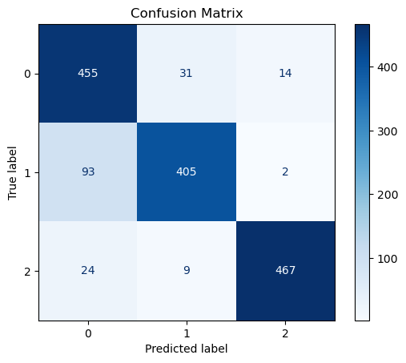
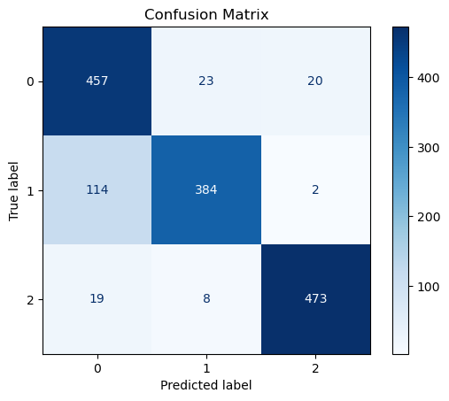

# algebraic-curves-classifier

This project implements a Convolutional Neural Network (CNN) to classify **degree 4 algebraic curves** into three categories: **smooth**, **nodal**, and **cuspidal**.  
It includes two model variants — one using **Max Pooling** and one using **Average Pooling** — with a comparison of their performance.

## Models

Two CNN variants were implemented to compare pooling strategies:

1. **Max Pooling Model**
   - Notebook: `Curve_Classifier_CNN_MAXPOOL.ipynb`
   - Trained weights: `cnn_max.pth`

2. **Average Pooling Model**
   - Notebook: `Curve_Classifier_CNN_AVGPOOL.ipynb`
   - Trained weights: `cnn_avg.pth`

## Key Observations

- The **Average Pooling** model achieved **~1% higher accuracy** overall compared to Max Pooling.
- The difference was especially noticeable in classifying **nodal curves**, where Average Pooling performed slightly but consistently better.
- While the performance gap is smaller than initially expected, the results suggest that pooling choice can have subtle but meaningful effects in curve classification tasks.

## Dataset

- Images: PNG format, 6×6 inches at 300 DPI, no axes or annotations.
- Labels: Provided via CSV files with curve type.
- Images are organized into separate folders for each curve type.
- All images were **downsized to 600×600 pixels** before being fed into the CNN.
- The CNN further **resizes images to 320×320 pixels on the fly** during training and evaluation.
- For nodal and cuspidal curves:
  - The **angle between tangents at nodes in train_data_5 and testing set (refer the data files for clarity)** was ensured to be at least `arctan(0.3)`.
  - The **coefficients of tangents** were chosen to avoid being too small, ensuring distinct features for the CNN.

## Usage

1. Open the desired Jupyter Notebook (`Curve_Classifier_CNN_MAXPOOL.ipynb` or `Curve_Classifier_CNN_AVGPOOL.ipynb`).
2. Adjust dataset paths in the code.
3. Run the notebook to train or evaluate the model.
4. Pre-trained weights (`cnn_max.pth` and `cnn_avg.pth`) can be loaded directly for inference.

## Confusion Matrix

The confusion matrix below shows model performance on the test dataset.

**Note:**  
The labels in the confusion matrix are represented as integers corresponding to curve types:

- **0** → Cuspidal  

- **1** → Nodal  
- **2** → Smooth  
### Average Pooling

### Max Pooling

## 📂 Dataset

The dataset used in this project is available on Google Drive:  
👉 [Download Dataset](https://drive.google.com/drive/folders/1TIgfaql8eRDTmbInn8tWRHQsZdZkx1G1?usp=drive_link)

## Requirements

- Python 3.x
- PyTorch
- torchvision
- numpy
- matplotlib
- pandas
- Jupyter Notebook

## License
This project is licensed under the MIT License – see the [LICENSE](LICENSE) file for details.
